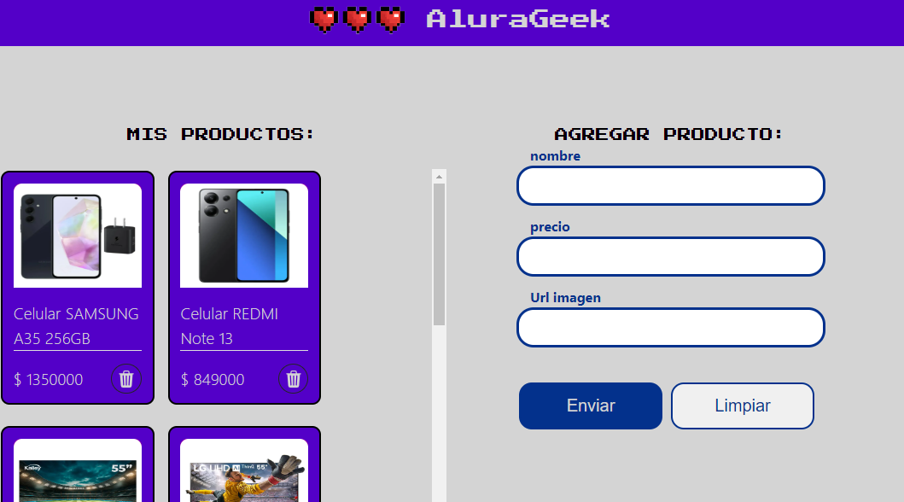

# Challenge AluraGeek



## Descripción
Este proyecto es la solución al desafío Alura Geek, donde se implementan conceptos avanzados de JavaScript como programación asíncrona, solicitudes HTTP, validación de formularios, manipulación del DOM y más.

Incluye un formulario para ingresar nombre, precio y URL de imagen de productos, con validación de inputs y botones para enviar y limpiar el formulario. Se utilizan eventos `addEventListener` para manejar acciones.

Además, la aplicación incluye una sección para renderizar todos los productos listados, con opciones para eliminar productos. 


### Instalación
Para iniciar el proyecto, instale las dependencias necesarias:

```bash
npm install json-server
